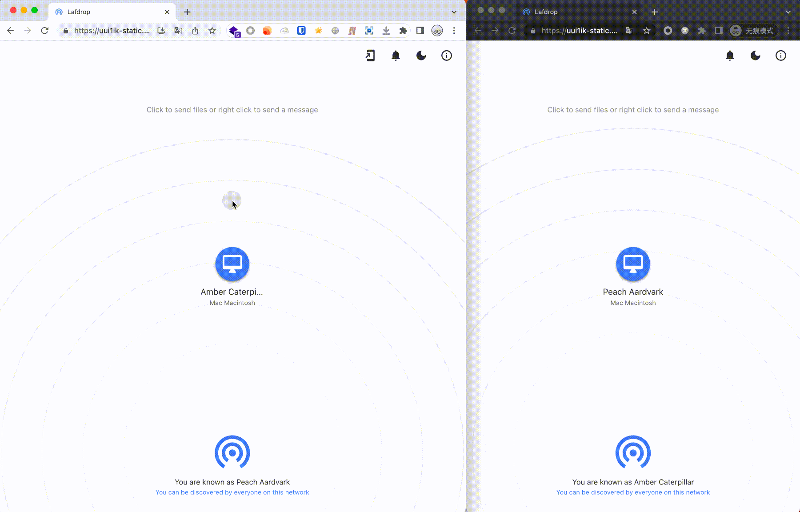

# lafdrop

Snapdrop in Laf



## Try it online

[Online Demo](https://uui1ik-static.site.laf.dev/)

## How to deploy in laf

- create laf app
- modify `laf.yaml` to your own `name` and `appid`
- push func and static file
  ```bash
  laf login
  laf func push
  laf dep push
  laf storage push static static
  ```
- open laf dashboard with browser, you can found everything is done, and you can visit

## Open Source

This repo is Laf version of [Snapdrop](https://github.com/RobinLinus/snapdrop), Because [Snapdrop](https://github.com/RobinLinus/snapdrop) open source with GPL-3.0, so [lafdrop](https://github.com/moonrailgun/lafdrop) is also under GPL-3.0.
